# CH-Cloud 企业级微服务架构平台

[](LICENSE)
[](https://www.oracle.com/java/)
[](https://spring.io/projects/spring-boot)
[](https://spring.io/projects/spring-cloud)

## 📖 项目简介

CH-Cloud是一个基于Spring Boot + Spring Cloud Alibaba构建的企业级微服务架构平台，采用前后端分离模式，为企业提供完整的微服务解决方案。平台集成了用户权限管理、单点登录、API网关、中间件管理等核心功能，支持高并发、高可用的分布式系统架构。

### ✨ 核心特性

- 🏗️ **微服务架构** - 基于Spring Cloud Alibaba生态，服务灵活扩展
- 🔐 **统一认证** - 基于JWT的单点登录系统，支持多因子认证
- 🛡️ **权限管理** - 完整的RBAC权限体系，支持多租户架构
- 🚪 **智能网关** - 基于Spring Cloud Gateway的API网关，支持动态路由
- 🔧 **中间件管理** - 统一的Kafka、RocketMQ、Nacos、Redis管理平台
- 📊 **监控运维** - 集成Prometheus、Grafana监控体系
- 🐳 **容器化部署** - 支持Docker、Kubernetes部署
- 📚 **API文档** - 集成Swagger/OpenAPI文档

### 🛠️ 技术栈

| 技术 | 版本 | 说明 |
|------|------|------|
| Spring Boot | 2.6.x | 基础框架 |
| Spring Cloud | 2021.0.1+ | 微服务框架 |
| Spring Cloud Alibaba | 2021.0.1.0 | 阿里云组件 |
| Nacos | 2.0+ | 注册中心/配置中心 |
| Redis | 6.0+ | 缓存中间件 |
| MySQL | 8.0+ | 主数据库 |
| RocketMQ | 4.9+ | 消息队列 |
| Kafka | 2.8+ | 消息队列 |
| Sentinel | 1.8+ | 流量控制 |
| MyBatis Plus | 3.5.x | ORM框架 |
### 软件架构
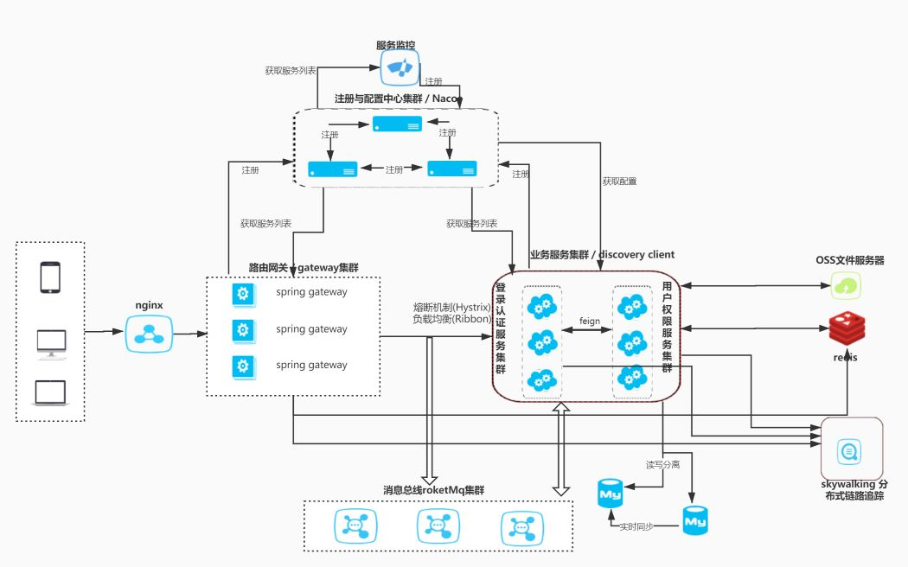

>服务注册与调用
基于Nacos来实现的服务注册与调用，在Spring Cloud中使用Feign, 我们可以做到使用HTTP请求远程服务时能与调用本地方法一样的编码体验，开发者完全感知不到这是远程方法，更感知不到这是个HTTP请求。

>服务鉴权  
通过JWT的方式来加强服务之间调度的权限验证，保证内部服务的安全性。

>负载均衡  
将服务保留的rest进行代理和网关控制，除了平常经常使用的node.js、nginx外，Spring Cloud系列的gateway和ribbon，可以帮我们进行正常的网关管控和负载均衡。  
其中扩展和借鉴国内Alibaba Sentinel组件，方面进行限流。

>熔断机制  
因为采取了服务的分布，为了避免服务之间的调用“雪崩”，采用了Hystrix的作为熔断器，避免了服务之间的“雪崩”。

## 🏛️ 系统架构

### 整体架构图

```
┌─────────────────────────────────────────────────────────────────────────────────┐
│                                前端层 (Frontend Layer)                           │
├─────────────────────────────────────────────────────────────────────────────────┤
│  ┌─────────────────┐    ┌─────────────────┐    ┌─────────────────┐              │
│  │   CH-Admin      │    │   移动端应用    │    │   第三方应用    │              │
│  │  (管理后台)     │    │   (Mobile)      │    │   (Third Party) │              │
│  │   Vue.js 3.x    │    │   React Native  │    │   API Client    │              │
│  └─────────────────┘    └─────────────────┘    └─────────────────┘              │
└─────────────────────────────────────────────────────────────────────────────────┘
                                    │
                                    ▼
┌─────────────────────────────────────────────────────────────────────────────────┐
│                               网关层 (Gateway Layer)                            │
├─────────────────────────────────────────────────────────────────────────────────┤
│  ┌─────────────────────────────────────────────────────────────────────────────┐ │
│  │                        CH-Gateway (API网关)                                │ │
│  │  • 动态路由管理    • 权限验证    • 流量控制    • 请求日志                   │ │
│  │  • 负载均衡        • 熔断降级    • 监控告警    • 安全防护                   │ │
│  └─────────────────────────────────────────────────────────────────────────────┘ │
└─────────────────────────────────────────────────────────────────────────────────┘
                                    │
                                    ▼
┌─────────────────────────────────────────────────────────────────────────────────┐
│                              微服务层 (Microservices Layer)                     │
├─────────────────────────────────────────────────────────────────────────────────┤
│  ┌─────────────┐  ┌─────────────┐  ┌─────────────┐  ┌─────────────┐            │
│  │  CH-SSO     │  │  CH-UPMS    │  │ CH-DevOps   │  │  其他服务   │            │
│  │ (认证服务)  │  │ (权限管理)  │  │ (中间件管理) │  │ (可扩展)    │            │
│  │ 端口:7001   │  │ 端口:7002   │  │ 端口:7003   │  │ 端口:7xxx   │            │
│  └─────────────┘  └─────────────┘  └─────────────┘  └─────────────┘            │
└─────────────────────────────────────────────────────────────────────────────────┘
                                    │
                                    ▼
┌─────────────────────────────────────────────────────────────────────────────────┐
│                              基础设施层 (Infrastructure Layer)                  │
├─────────────────────────────────────────────────────────────────────────────────┤
│  ┌─────────────┐  ┌─────────────┐  ┌─────────────┐  ┌─────────────┐            │
│  │   Nacos     │  │    Redis    │  │   MySQL     │  │  RocketMQ   │            │
│  │ (注册中心)  │  │   (缓存)    │  │  (数据库)   │  │  (消息队列) │            │
│  │ 端口:8848   │  │ 端口:6379   │  │ 端口:3306   │  │ 端口:9876   │            │
│  └─────────────┘  └─────────────┘  └─────────────┘  └─────────────┘            │
└─────────────────────────────────────────────────────────────────────────────────┘
```

### 部署架构图

```
┌─────────────────────────────────────────────────────────────────────────────────┐
│                              基础服务层 (Base Services)                         │
├─────────────────────────────────────────────────────────────────────────────────┤
│  ┌─────────────┐  ┌─────────────┐  ┌─────────────┐                            │
│  │   MySQL     │  │    Redis    │  │   Nacos     │                            │
│  │ 8.0+        │  │ 6.0+        │  │ 2.0+        │                            │
│  │ 数据存储    │  │ 缓存中间件  │  │ 注册/配置中心│                            │
│  └─────────────┘  └─────────────┘  └─────────────┘                            │
└─────────────────────────────────────────────────────────────────────────────────┘
                                    │
                                    ▼
┌─────────────────────────────────────────────────────────────────────────────────┐
│                              微服务层 (Microservices)                           │
├─────────────────────────────────────────────────────────────────────────────────┤
│  ┌─────────────┐  ┌─────────────┐  ┌─────────────┐  ┌─────────────┐            │
│  │  CH-SSO     │  │  CH-UPMS    │  │ CH-Gateway  │  │ CH-DevOps   │            │
│  │ 认证服务    │  │ 权限管理    │  │ API网关     │  │ 中间件管理  │            │
│  │ 2.1.0-SNAPSHOT│ 20250906032302│ 20250906035834│ 20250906034927│            │
│  └─────────────┘  └─────────────┘  └─────────────┘  └─────────────┘            │
│  ┌─────────────┐                                                                 │
│  │  CH-Admin   │                                                                 │
│  │ 前端管理    │                                                                 │
│  │ 20250809021803│                                                               │
│  └─────────────┘                                                                 │
└─────────────────────────────────────────────────────────────────────────────────┘
```

### 服务通信流程图

```
用户请求 → CH-Admin → CH-Gateway → 微服务集群
    │         │           │            │
    │         │           │            ▼
    │         │           │    ┌─────────────┐
    │         │           │    │  CH-SSO     │
    │         │           │    │ (认证服务)  │
    │         │           │    └─────────────┘
    │         │           │            │
    │         │           │            ▼
    │         │           │    ┌─────────────┐
    │         │           │    │  CH-UPMS    │
    │         │           │    │ (权限管理)  │
    │         │           │    └─────────────┘
    │         │           │            │
    │         │           │            ▼
    │         │           │    ┌─────────────┐
    │         │           │    │ CH-DevOps   │
    │         │           │    │ (中间件管理)│
    │         │           │    └─────────────┘
    │         │           │
    │         │           ▼
    │         │    ┌─────────────┐
    │         │    │   Nacos     │
    │         │    │ (服务发现)  │
    │         │    └─────────────┘
    │         │
    │         ▼
    │    ┌─────────────┐
    │    │    Redis    │
    │    │   (缓存)    │
    │    └─────────────┘
    │
    ▼
┌─────────────┐
│   MySQL     │
│  (数据库)   │
└─────────────┘
```

### 技术架构图

```
┌─────────────────────────────────────────────────────────────────────────────────┐
│                              技术栈架构 (Technology Stack)                      │
├─────────────────────────────────────────────────────────────────────────────────┤
│                                                                                 │
│  ┌─────────────────────────────────────────────────────────────────────────────┐ │
│  │                            前端技术栈                                       │ │
│  │  ┌─────────────┐  ┌─────────────┐  ┌─────────────┐  ┌─────────────┐      │ │
│  │  │   Vue.js 3.x│  │ Element Plus│  │   Axios     │  │   Router    │      │ │
│  │  │   响应式框架 │  │   UI组件库  │  │  HTTP客户端 │  │  路由管理   │      │ │
│  │  └─────────────┘  └─────────────┘  └─────────────┘  └─────────────┘      │ │
│  └─────────────────────────────────────────────────────────────────────────────┘ │
│                                    │                                             │
│                                    ▼                                             │
│  ┌─────────────────────────────────────────────────────────────────────────────┐ │
│  │                            Spring Cloud 微服务架构                         │ │
│  │  ┌─────────────┐  ┌─────────────┐  ┌─────────────┐  ┌─────────────┐      │ │
│  │  │Spring Boot  │  │Spring Cloud │  │Spring Cloud │  │Spring Cloud │      │ │
│  │  │   2.6.x     │  │   Gateway   │  │   Alibaba   │  │   Security  │      │ │
│  │  │   基础框架   │  │   API网关   │  │   阿里组件  │  │   安全框架  │      │ │
│  │  └─────────────┘  └─────────────┘  └─────────────┘  └─────────────┘      │ │
│  │  ┌─────────────┐  ┌─────────────┐  ┌─────────────┐  ┌─────────────┐      │ │
│  │  │  MyBatis    │  │   Sentinel  │  │    Feign    │  │   Ribbon    │      │ │
│  │  │    Plus     │  │   流量控制  │  │  服务调用   │  │  负载均衡   │      │ │
│  │  │   ORM框架   │  │   熔断降级  │  │   客户端    │  │   客户端    │      │ │
│  │  └─────────────┘  └─────────────┘  └─────────────┘  └─────────────┘      │ │
│  └─────────────────────────────────────────────────────────────────────────────┘ │
│                                    │                                             │
│                                    ▼                                             │
│  ┌─────────────────────────────────────────────────────────────────────────────┐ │
│  │                            中间件技术栈                                     │ │
│  │  ┌─────────────┐  ┌─────────────┐  ┌─────────────┐  ┌─────────────┐      │ │
│  │  │   Nacos     │  │    Redis    │  │   MySQL     │  │  RocketMQ   │      │ │
│  │  │ 注册/配置中心│  │   缓存中间件│  │   关系数据库│  │   消息队列  │      │ │
│  │  │   2.0+      │  │    6.0+     │  │    8.0+     │  │    4.9+     │      │ │
│  │  └─────────────┘  └─────────────┘  └─────────────┘  └─────────────┘      │ │
│  │  ┌─────────────┐  ┌─────────────┐  ┌─────────────┐  ┌─────────────┐      │ │
│  │  │   Kafka     │  │   Docker    │  │ Kubernetes  │  │   Nginx     │      │ │
│  │  │   消息队列  │  │   容器化    │  │   容器编排  │  │   反向代理  │      │ │
│  │  │    2.8+     │  │   20.10+    │  │    1.20+    │  │    1.18+    │      │ │
│  │  └─────────────┘  └─────────────┘  └─────────────┘  └─────────────┘      │ │
│  └─────────────────────────────────────────────────────────────────────────────┘ │
└─────────────────────────────────────────────────────────────────────────────────┘
```

### 数据流架构图

```
┌─────────────────────────────────────────────────────────────────────────────────┐
│                              数据流向 (Data Flow)                               │
├─────────────────────────────────────────────────────────────────────────────────┤
│                                                                                 │
│  用户请求 ──┐                                                                   │
│            │                                                                   │
│            ▼                                                                   │
│  ┌─────────────────┐    ┌─────────────────┐    ┌─────────────────┐            │
│  │   CH-Admin      │───►│  CH-Gateway     │───►│   微服务集群    │            │
│  │  (前端应用)     │    │  (API网关)      │    │  (业务处理)     │            │
│  └─────────────────┘    └─────────────────┘    └─────────────────┘            │
│            │                       │                       │                  │
│            │                       │                       ▼                  │
│            │                       │              ┌─────────────────┐         │
│            │                       │              │   Nacos        │         │
│            │                       │              │  (服务发现)     │         │
│            │                       │              └─────────────────┘         │
│            │                       │                       │                  │
│            │                       ▼                       ▼                  │
│            │              ┌─────────────────┐    ┌─────────────────┐         │
│            │              │    Redis        │    │    MySQL        │         │
│            │              │   (缓存)        │    │   (数据存储)    │         │
│            │              └─────────────────┘    └─────────────────┘         │
│            │                       │                       │                  │
│            │                       │                       ▼                  │
│            │                       │              ┌─────────────────┐         │
│            │                       │              │  RocketMQ       │         │
│            │                       │              │  (消息队列)     │         │
│            │                       │              └─────────────────┘         │
│            │                       │                       │                  │
│            │                       └───────────────────────┘                  │
│            │                                                                   │
│            ▼                                                                   │
│  ┌─────────────────┐                                                          │
│  │   响应数据      │                                                          │
│  │  (JSON/HTML)    │                                                          │
│  └─────────────────┘                                                          │
└─────────────────────────────────────────────────────────────────────────────────┘
```

### Docker容器化部署架构图

```
┌─────────────────────────────────────────────────────────────────────────────────┐
│                          Docker容器化部署架构 (Container Deployment)            │
├─────────────────────────────────────────────────────────────────────────────────┤
│                                                                                 │
│  ┌─────────────────────────────────────────────────────────────────────────────┐ │
│  │                              基础服务容器                                   │ │
│  │  ┌─────────────┐  ┌─────────────┐  ┌─────────────┐                        │ │
│  │  │   MySQL     │  │    Redis    │  │   Nacos     │                        │ │
│  │  │ 8.0:latest  │  │ 6.2-alpine  │  │ v2.0.3      │                        │ │
│  │  │ 端口:3306   │  │ 端口:6379   │  │ 端口:8848   │                        │ │
│  │  │ 数据持久化  │  │ 数据持久化  │  │ 配置持久化  │                        │ │
│  │  └─────────────┘  └─────────────┘  └─────────────┘                        │ │
│  └─────────────────────────────────────────────────────────────────────────────┘ │
│                                    │                                             │
│                                    ▼                                             │
│  ┌─────────────────────────────────────────────────────────────────────────────┐ │
│  │                              微服务容器                                     │ │
│  │  ┌─────────────┐  ┌─────────────┐  ┌─────────────┐  ┌─────────────┐      │ │
│  │  │  CH-SSO     │  │  CH-UPMS    │  │ CH-Gateway  │  │ CH-DevOps   │      │ │
│  │  │ 2.1.0-SNAPSHOT│ 20250906032302│ 20250906035834│ 20250906034927│      │ │
│  │  │ 端口:7001   │  │ 端口:7002   │  │ 端口:7000   │  │ 端口:7003   │      │ │
│  │  │ 依赖Nacos   │  │ 依赖Nacos   │  │ 依赖Nacos   │  │ 依赖Nacos   │      │ │
│  │  └─────────────┘  └─────────────┘  └─────────────┘  └─────────────┘      │ │
│  │  ┌─────────────┐                                                          │ │
│  │  │  CH-Admin   │                                                          │ │
│  │  │ 20250809021803│                                                        │ │
│  │  │ 端口:8081   │                                                          │ │
│  │  │ 依赖Gateway │                                                          │ │
│  │  └─────────────┘                                                          │ │
│  └─────────────────────────────────────────────────────────────────────────────┘ │
│                                                                                 │
│  ┌─────────────────────────────────────────────────────────────────────────────┐ │
│  │                              网络配置                                       │ │
│  │  • 自定义网络: ch-network                                                   │ │
│  │  • 服务间通信: 容器名解析                                                   │ │
│  │  • 外部访问: 端口映射                                                       │ │
│  │  • 数据持久化: Docker Volume                                                │ │
│  └─────────────────────────────────────────────────────────────────────────────┘ │
└─────────────────────────────────────────────────────────────────────────────────┘
```

### 服务依赖关系图

```
┌─────────────────────────────────────────────────────────────────────────────────┐
│                           服务依赖关系 (Service Dependencies)                   │
├─────────────────────────────────────────────────────────────────────────────────┤
│                                                                                 │
│  ┌─────────────┐    ┌─────────────┐    ┌─────────────┐    ┌─────────────┐     │
│  │  CH-Admin   │───►│ CH-Gateway  │───►│   CH-SSO    │───►│   Nacos     │     │
│  │  (前端)     │    │  (网关)     │    │  (认证)     │    │ (注册中心)  │     │
│  └─────────────┘    └─────────────┘    └─────────────┘    └─────────────┘     │
│                           │                   │                   │            │
│                           │                   │                   │            │
│                           ▼                   ▼                   ▼            │
│                    ┌─────────────┐    ┌─────────────┐    ┌─────────────┐     │
│                    │  CH-UPMS    │───►│    Redis    │    │   MySQL     │     │
│                    │  (权限)     │    │  (缓存)     │    │ (数据库)    │     │
│                    └─────────────┘    └─────────────┘    └─────────────┘     │
│                           │                   │                   │            │
│                           │                   │                   │            │
│                           ▼                   ▼                   ▼            │
│                    ┌─────────────┐    ┌─────────────┐    ┌─────────────┐     │
│                    │ CH-DevOps   │───►│  RocketMQ   │    │   Kafka     │     │
│                    │ (中间件管理) │    │  (消息队列) │    │  (消息队列) │     │
│                    └─────────────┘    └─────────────┘    └─────────────┘     │
└─────────────────────────────────────────────────────────────────────────────────┘
```

### 核心服务说明

#### 1. CH-Admin 前端管理界面
- **技术栈**: Vue.js 3.x + Element Plus
- **功能**: 系统管理、日志管理、中间件管理
- **特色**: 响应式设计、组件化开发

源码仓库[ch-admin](https://github.com/zhimin711/ch-admin)

#### 2. CH-SSO 单点登录服务
- **技术栈**: Spring Boot + Spring Security + JWT
- **功能**: 用户认证、令牌管理、多因子认证
- **特色**: 支持图形验证码、滑动拼图、点选文字验证码

源码仓库[ch-sso](https://github.com/zhimin711/ch-sso)

#### 3. CH-UPMS 用户权限管理服务
- **技术栈**: Spring Boot + MyBatis Plus + ShardingSphere
- **功能**: 用户管理、角色管理、权限管理、组织架构
- **特色**: 多租户支持、项目权限管理、数据字典

源码仓库[ch-upms](https://github.com/zhimin711/ch-upms)

#### 4. CH-Gateway API网关服务
- **技术栈**: Spring Cloud Gateway + Sentinel
- **功能**: 路由转发、权限验证、流量控制、请求日志
- **特色**: 动态路由、Cookie自动刷新、多层权限过滤

源码仓库[ch-gateway](https://github.com/zhimin711/ch-gateway)

#### 5. CH-DevOps 中间件管理平台
- **技术栈**: Spring Boot + Spring Cloud
- **功能**: Kafka管理、RocketMQ管理、Nacos管理、Redis管理
- **特色**: 统一管理、实时监控、配置管理

源码仓库[ch-devops](https://github.com/zhimin711/ch-devops)

## 🚀 快速开始

### 依赖服务

- **MySQL**: 8.0+
- **Redis**: 6.0+
- **Nacos**: 2.0+
- **RocketMQ**: 4.9+ 


### 环境要求

- **JDK**: 1.8+
- **Maven**: 3.6+
- **Docker**: 20.10+ (内存5G以上)


### 安装部署

#### 克隆或下载项目

```shell
git clone https://github.com/zhimin711/ch-admin-wiki.git
cd ch-admin-wiki
```

#### 初始化数据库

**1. 数据库初始化**
```sql
-- 创建数据库
CREATE DATABASE ch_sso CHARACTER SET utf8mb4 COLLATE utf8mb4_unicode_ci;
CREATE DATABASE ch_upms CHARACTER SET utf8mb4 COLLATE utf8mb4_unicode_ci;
CREATE DATABASE ch_devops CHARACTER SET utf8mb4 COLLATE utf8mb4_unicode_ci;

-- 执行各服务的SQL脚本
-- UPMS服务脚本
source ./db/ch-upms.sql

-- Devops服务脚本
source ./db/ch-devops.sql

```

#### 添加动态配置

**2. 添加Nacos动态配置文件**
***数据库、Redis、rocketMQ***
- 修改各服务的数据库连接配置
- 修改Redis连接配置
- 修改Nacos配置中心地址 

> SSO配置  
Data ID: ch-sso.yml  
Group: ch-sso  
复制文件内容[nacos/ch-sso/ch-sso.yml](nacos/ch-sso/ch-sso.yml)  
> UPMS配置  
Data ID: ch-upms.yml  
Group: ch-upms  
复制文件内容[nacos/ch-upms/ch-upms.yml](nacos/ch-upms/ch-upms.yml)  
> gateway配置  
Data ID: ch-gateway.yml  
Group: ch-gateway  
复制文件内容[nacos/ch-gateway/ch-gateway.yml](nacos/ch-gateway/ch-gateway.yml)  

> devops配置  
Data ID: ch-gateway.yml  
Group: ch-gateway  
复制文件内容[nacos/ch-gateway/ch-gateway.yml](nacos/ch-gateway/ch-gateway.yml)  


#### Docker最小化部署
##### 3.2 启动微服务

```bash
# 启动微服务
docker-compose -f docker-compose-microservices.yml up -d

# 查看微服务状态
docker-compose -f docker-compose-microservices.yml ps
```

##### 3.3 查看服务日志

```bash
# 查看SSO服务日志
docker-compose -f docker-compose-microservices.yml logs -f ch-sso

# 查看UPMS服务日志
docker-compose -f docker-compose-microservices.yml logs -f ch-upms

# 查看Gateway服务日志
docker-compose -f docker-compose-microservices.yml logs -f ch-gateway
```

## 第四步：验证部署

### 4.1 检查服务状态

| 服务 | 地址 | 状态检查 |
|------|------|----------|
| 前端管理界面 | http://localhost:8081 | 浏览器访问 |
| SSO认证服务 | http://localhost:7001 | http://localhost:7001/actuator/health |
| UPMS权限服务 | http://localhost:7002 | http://localhost:7002/actuator/health |
| Gateway网关 | http://localhost:7000 | http://localhost:7000/actuator/health |
| DevOps中间件 | http://localhost:7003 | http://localhost:7003/actuator/health |

### 4.2 测试登录

- **访问地址**: http://localhost:8081
- **管理员账号**: admin
- **默认密码**: admin123


## 📋 功能特性

### 🔐 认证授权
- **单点登录**: 基于JWT的统一身份认证
- **多因子认证**: 支持用户名密码+验证码双重认证
- **令牌管理**: 自动刷新、过期处理、安全注销
- **权限控制**: 基于RBAC的精细化权限管理

### 🏢 组织管理
- **用户管理**: 用户增删改查、角色分配、状态管理
- **角色管理**: 角色权限分配、角色类型管理
- **组织架构**: 部门层级管理、职位管理
- **多租户**: 支持多租户架构，数据隔离

### 🚪 网关服务
- **动态路由**: 基于Nacos的动态路由管理
- **权限验证**: 多层权限过滤器链
- **流量控制**: 基于Sentinel的限流熔断
- **请求日志**: 完整的请求响应日志记录

### 🔧 中间件管理
- **Kafka管理**: 集群管理、主题管理、消息监控
- **RocketMQ管理**: 集群管理、主题管理、消息发送
- **Nacos管理**: 配置管理、服务发现、命名空间管理
- **Redis管理**: 数据库管理、键值操作、集群监控

## 📚 API文档

各服务均提供完整的API文档：

| 服务 | API文档地址 | 说明 |
|------|-------------|------|
| SSO认证服务 | http://localhost:7000/swagger-ui/index.html | 认证相关接口 |
| UPMS权限服务 | http://localhost:7002/swagger-ui/index.html | 权限管理接口 |
| Gateway网关 | http://localhost:7001/swagger-ui.html | 网关管理接口 |
| DevOps中间件 | http://localhost:7003/swagger-ui.html | 中间件管理接口 |


## 🔍 监控运维

### 健康检查

各服务均提供健康检查端点：

- **SSO服务**: http://localhost:7000/actuator/health
- **UPMS服务**: http://localhost:7002/actuator/health
- **Gateway服务**: http://localhost:7001/actuator/health
- **DevOps服务**: http://localhost:7003/actuator/health

### 监控指标

- **JVM指标**: 内存使用、GC情况、线程状态
- **业务指标**: API调用次数、错误率、响应时间
- **中间件指标**: 连接数、消息积压、响应时间

## 🤝 贡献指南

我们欢迎所有形式的贡献！

### 贡献步骤

1. **Fork 本仓库**
2. **创建特性分支** (`git checkout -b feature/AmazingFeature`)
3. **提交更改** (`git commit -m 'Add some AmazingFeature'`)
4. **推送分支** (`git push origin feature/AmazingFeature`)
5. **创建 Pull Request**

### 代码规范

- 遵循阿里巴巴Java开发手册
- 使用统一的代码格式化配置
- 添加必要的注释和文档
- 编写单元测试

## 📄 许可证

本项目采用 [Apache License 2.0](LICENSE) 开源协议。

## 📞 联系我们

- **项目地址**: https://gitee.com/ch-cloud/ch-cloud
- **问题反馈**: https://gitee.com/ch-cloud/ch-cloud/issues
- **QQ群**: 27754177

## 🙏 致谢

感谢以下开源项目的支持：

- [Spring Boot](https://spring.io/projects/spring-boot)
- [Spring Cloud Alibaba](https://github.com/alibaba/spring-cloud-alibaba)
- [Nacos](https://nacos.io/)
- [Redis](https://redis.io/)
- [MyBatis Plus](https://baomidou.com/)

---

## 📱 使用说明
<table>
    <tr>
        <td>登录</td>
        <td>首页</td>
    </tr>
    <tr>
        <td>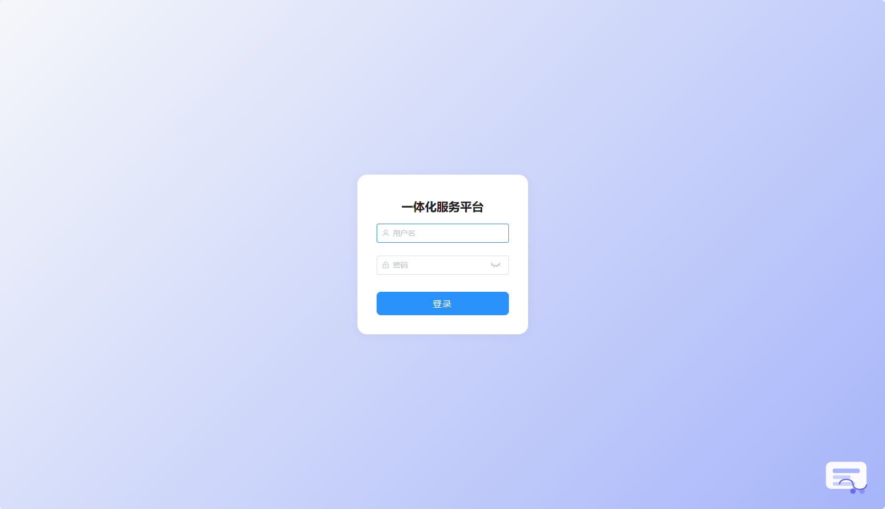</td>
        <td>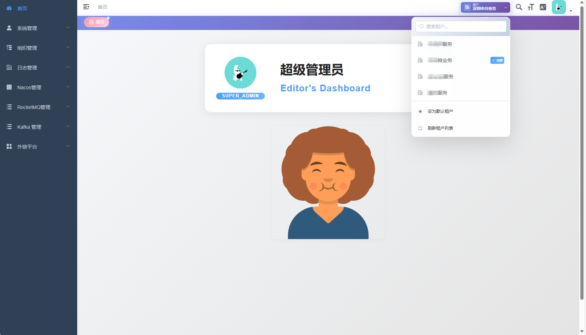</td>
    </tr>
    <tr>
        <td>用户管理</td>
        <td>角色管理</td>
    </tr>
    <tr>
        <td>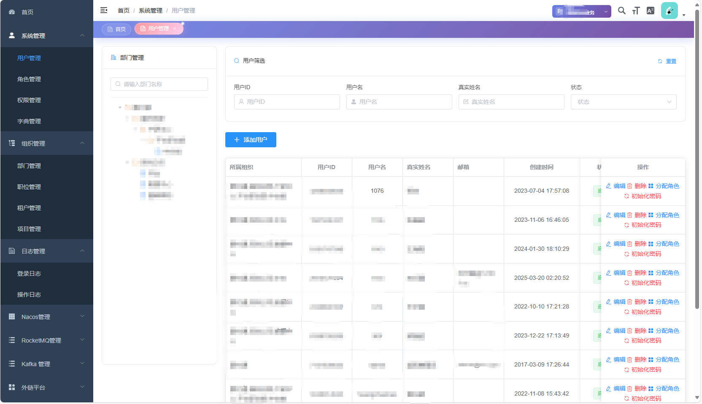</td>
        <td>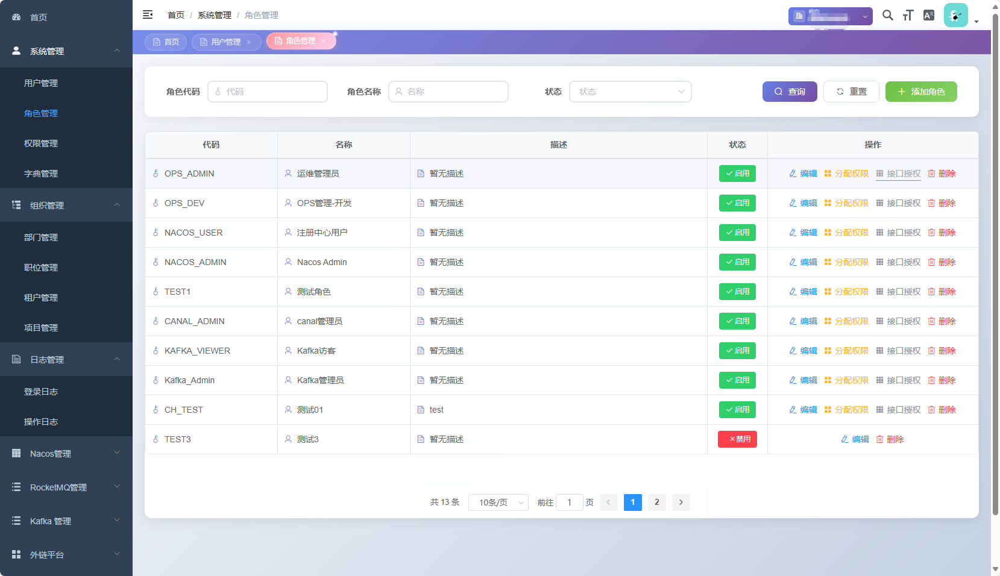</td>
    </tr>
    <tr>
        <td>权限管理</td>
        <td>组织管理</td>
    </tr>
    <tr>
        <td>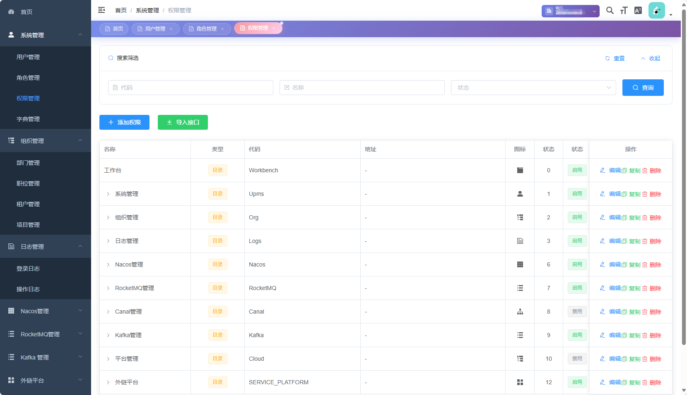</td>
        <td>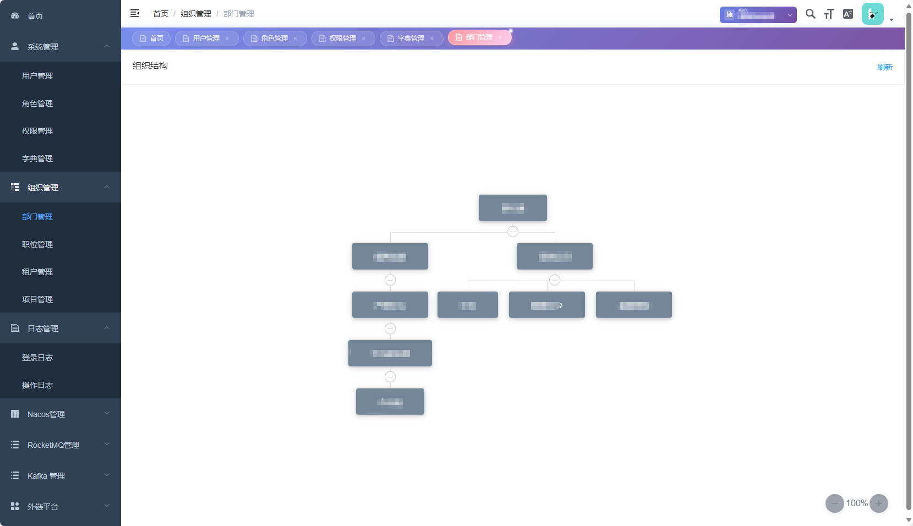</td>
    </tr>
    <tr>
        <td>职位管理</td>
        <td>数据字典</td>
    </tr>
	<tr>
        <td>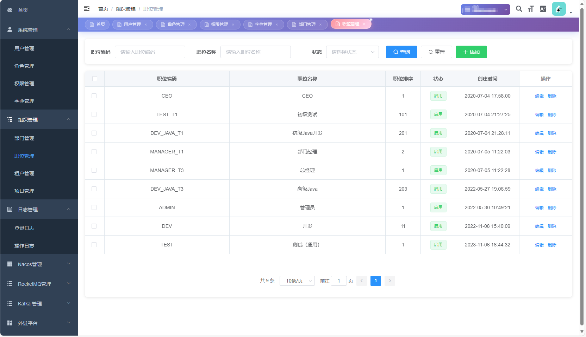</td>
        <td>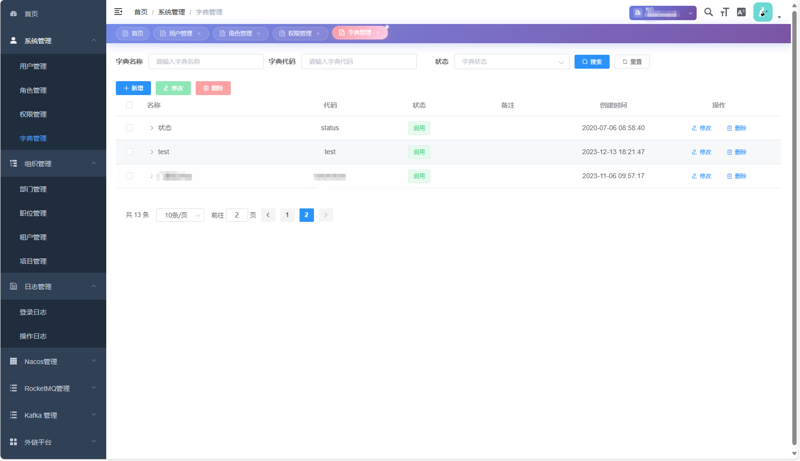</td>
    </tr>	
    <tr>
        <td>登录日志</td>
        <td>操作日志</td>
    </tr> 
    <tr>
        <td>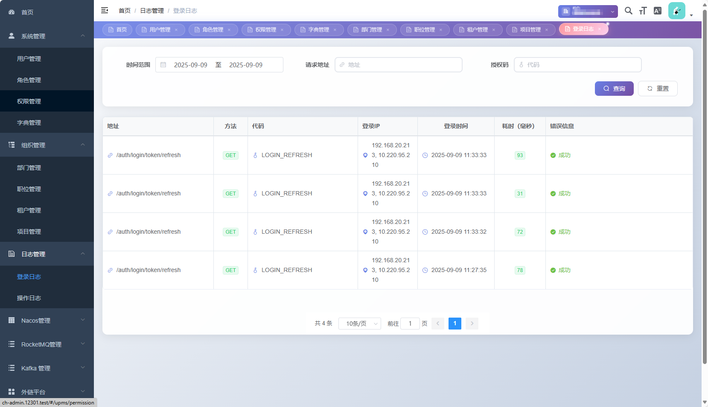</td>
        <td>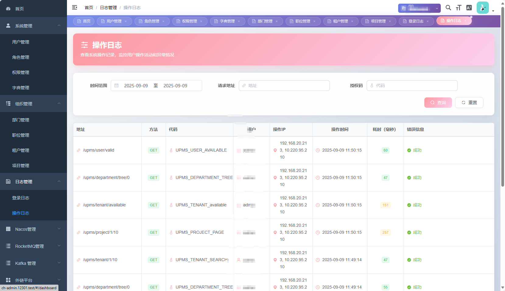</td>
    </tr>
</table>


<table>
    <tr>
        <td>Nacos集群管理</td>
        <td>Nacos应用配置管理</td>
    </tr>
    <tr>
        <td>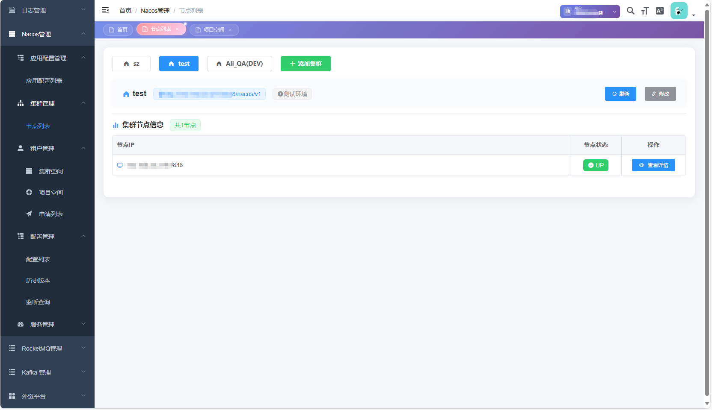</td>
        <td>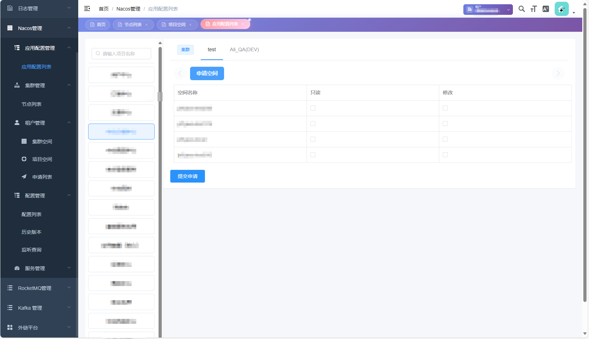</td>
    </tr>
    <tr>
        <td>Nacos应用配置权限申请</td>
        <td>Kafka集群管理</td>
    </tr>
    <tr>
        <td></td>
        <td>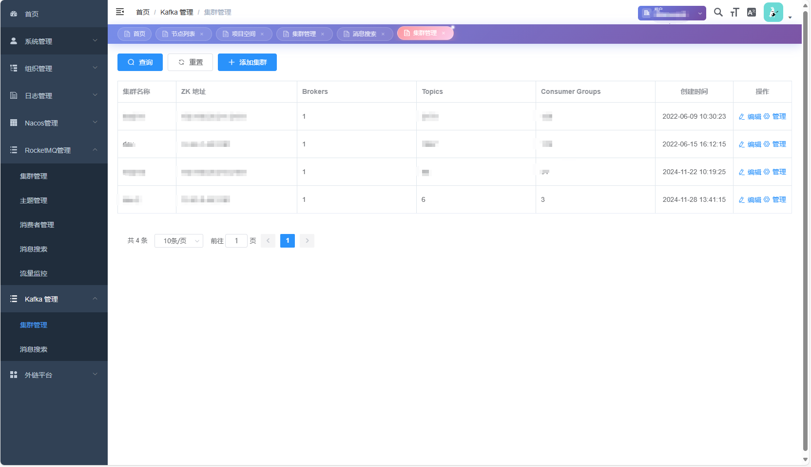</td>
    </tr>
    <tr>
        <td>RocketMQ集群管理</td>
        <td></td>
    </tr>
    <tr>
        <td>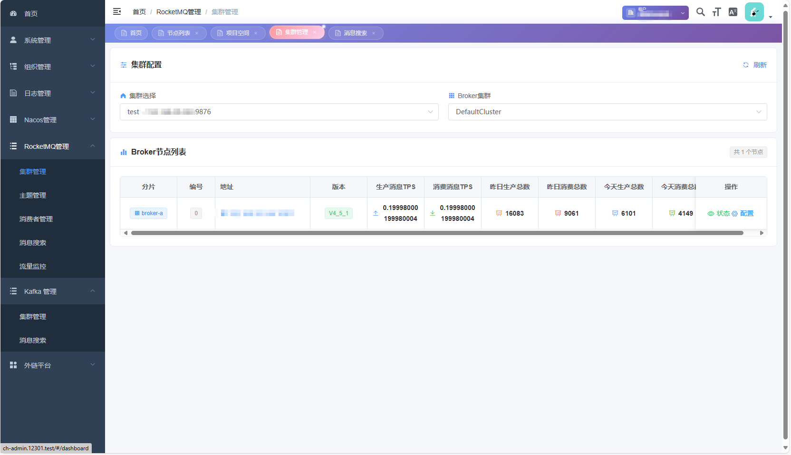</td>
        <td></td>
    </tr>
</table>

---

<div align="center">

**如果这个项目对您有帮助，请给我们一个 ⭐️ Star**

Made with ❤️ by CH-Cloud Team

</div>

